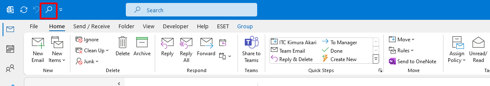

# Using python to creat Add-in for your outlook 
- You can creat an Add-in to search folder on Outlook easily
- python -- version **3.12.2**
- &C:\Users\chukh\AppData\Roaming\Python\Python312\Scripts\
  &C:\Users\admin\AppData\Roaming\Python\Python312\Scripts\ 
- pyinstaller --noconfirm --onedir --windowed --icon "snubby.ico" "Search folder.py" 

# Used library
- sys
- win32com.client : You need to install libraries such as **win32com.client** to interact with Outlook from Python.
- PyQt5
- pyinstaller : using to convert Python to **.exe** file

# Creat Marco on Outlook to open .exe file
- After creat GUI.py and Main (Search folder.py) file you need to creed Marcro to open **.exe** file 
- Open Outlook > Push "Alt + F11" 
- Add code as bellow. Save and close VBA 
  """
  Sub CallPythonExe()
    Dim shell As Object
    Set shell = CreateObject("WScript.Shell")
    shell.Run Chr(34) & "C:\Search folder\Search folder.exe" & Chr(34)
  End Sub
  """
- I have saved the **Search folder** containing **Search folder.exe** in the C drive.

- Open Trust Center setting 
  File > Options > Trust Center > Trust Center Settings
  Choose "Enable all macros (not recommended; potentially dangerous code can run)"

- Open **"Customize Quick Access Toolbar:"** > **Customize Quick Access Toolbar**
- **"Choose commands from"** > **Macros**
- Choose **"CallPythonExe"** > **"Add >>"**
- Let see the **Quick Access Toolbar**
  
- Click to open search window, For example, imput "Hung" to the search box 
  

